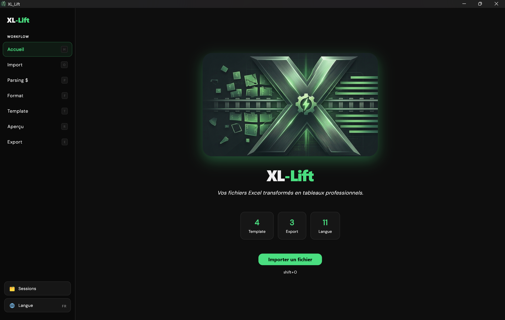
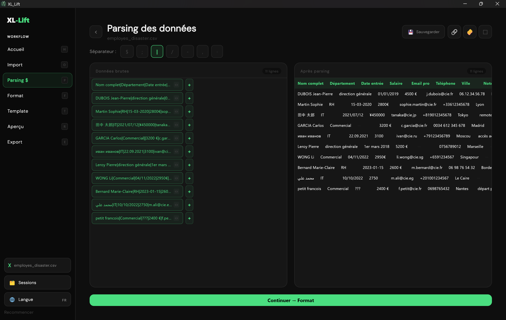
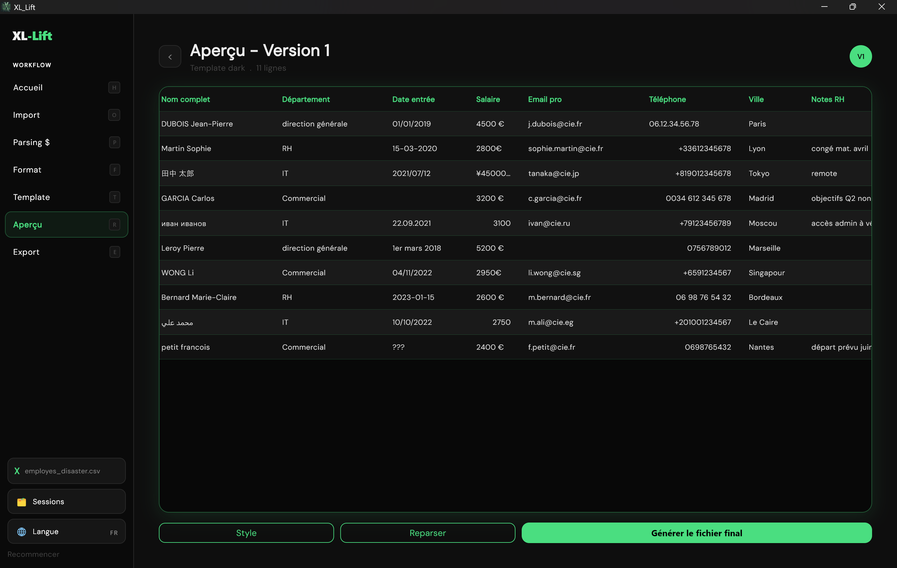

# XL-Lift

**Excel & CSV Cleaner for Windows** — turn messy spreadsheets into clean, professional tables in seconds.

You know the pain. A colleague sends you a CSV file with mixed separators, inconsistent date formats, salaries mixed with currencies, and columns that make zero sense. You spend 20 minutes just cleaning it before you can even start working.

XL-Lift does that job for you — automatically. Everything runs 100% locally — no data ever leaves your machine.

---

## Download

This repository contains the compiled beta build only — no source code.

👉 **[Download the free beta](../../releases/latest)** (export locked)

👉 **[Get the full version (€25)](xllift.gumroad.com/l/snxel)** on Gumroad

| | Beta (free) | Full (€25) |
|---|---|---|
| Import & parsing | ✅ | ✅ |
| Live preview | ✅ | ✅ |
| Templates & themes | ✅ | ✅ |
| Export (XLSX/CSV/MD) | 🔒 | ✅ |

---

## What XL-Lift does

Import your file, pick your separator, preview the result in real time, apply a professional template, and export a clean, formatted file.

## Features

- **Smart parsing** — custom separators ($, ;, |, /, -, comma, tab) with live before/after preview
- **4 professional templates** — Minimal, Corporate, Dark, Colorful
- **6 accent colors**
- **3 export formats** — Excel (.xlsx), CSV (RFC 4180, UTF-8 BOM), Markdown (.md)
- **Session history** with resume support
- **11 languages** — French, English, Spanish, Portuguese, German, Italian, Russian, Arabic, Japanese, Chinese, Armenian
- **100% local** — no internet required, no account, no telemetry, no GDPR headache
- **Keyboard shortcuts** for power users

---

## System Requirements

- Windows 10 or later (64-bit)
- No installation of Excel required

---

## Usage

1. Launch XL-Lift
2. Import your .xlsx or .csv file (drag & drop or file picker)
3. Choose your column separator and clean the data
4. Select export format: Excel, CSV or Markdown
5. For Excel: pick a template and accent color, generate preview
6. Save your file

---

## Keyboard Shortcuts

| Shortcut | Action |
|----------|--------|
| Shift+O  | Open file |
| Shift+H  | Home |
| Shift+P  | Go to Parsing |
| Shift+F  | Go to Format |
| Shift+T  | Go to Template |
| Shift+R  | Go to Preview |
| Shift+E  | Go to Export |
| Ctrl+Z   | Undo (parse screen) |

---

## Feedback

Found a bug or have a suggestion? Open an issue or email **xllift.feedback@gmail.com**

---

## License

XL-Lift is proprietary software. All rights reserved.
Source code is not included in this repository. See LICENSE.txt for details.

## Third-Party Licenses

XL-Lift uses the following open-source packages.
See THIRD_PARTY_LICENSES.txt for full license texts.

| Package | Version | License |
|---------|---------|---------|
| archive | 3.4.x | BSD 3-Clause |
| csv | 6.0.x | MIT |
| excel | 4.0.x | MIT |
| file_picker | 8.0.x | MIT |
| fl_chart | 0.68.x | MIT |
| flutter (SDK) | 3.x | BSD 3-Clause |
| google_fonts | 6.2.x | Apache 2.0 |
| intl | 0.20.x | BSD 3-Clause |
| path_provider | 2.1.x | BSD 3-Clause |

---

© 2026 XL-Lift. All rights reserved.
